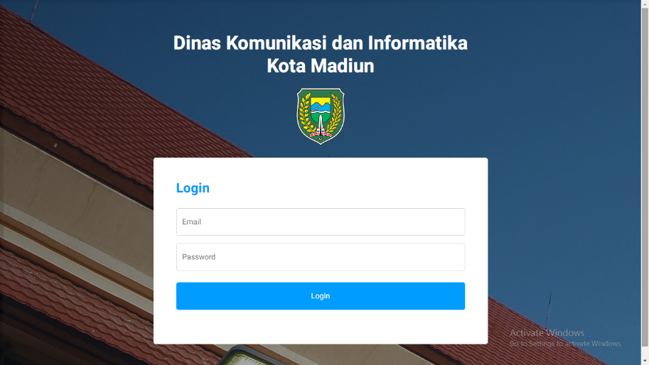
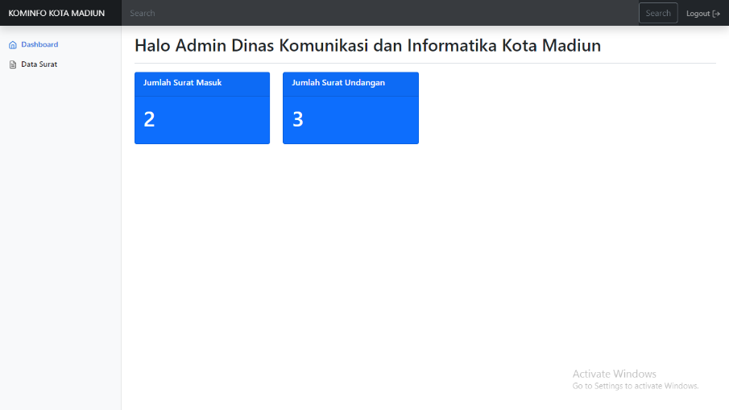
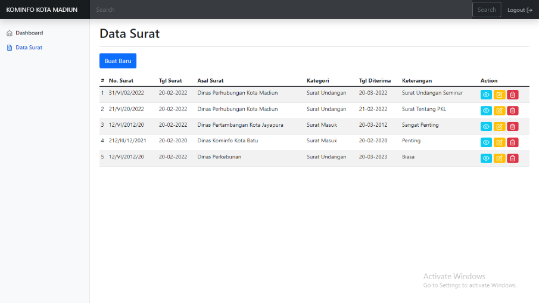
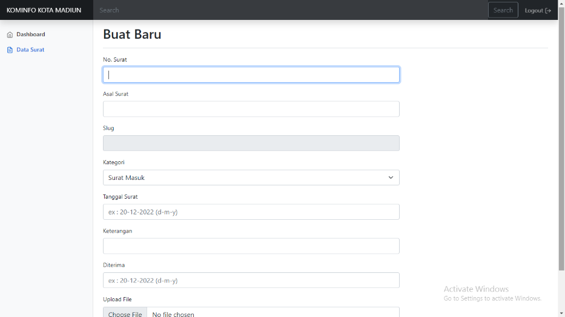
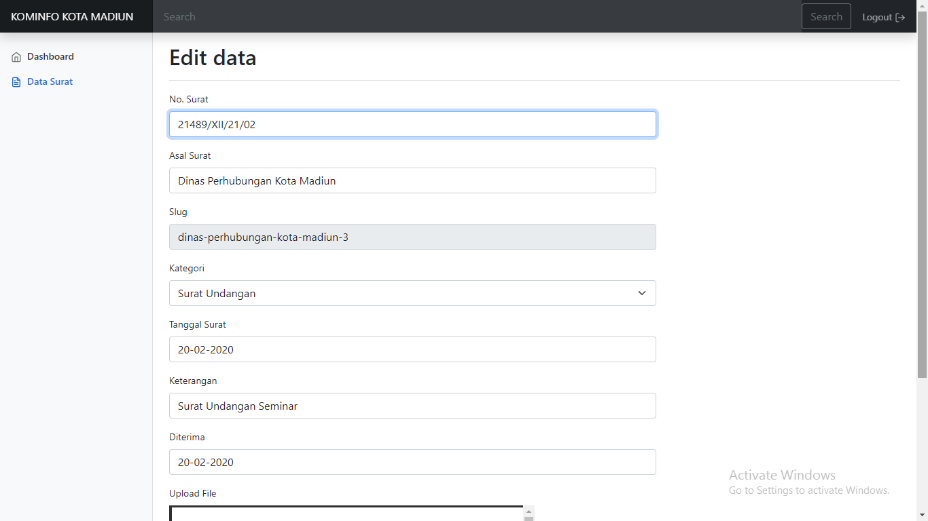
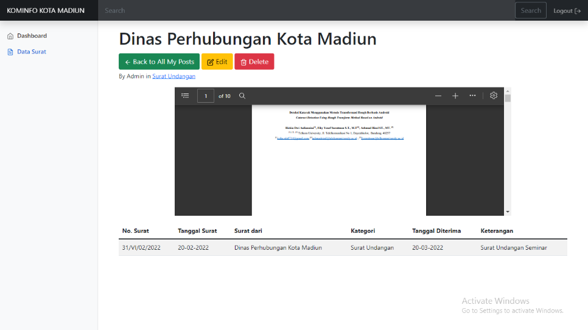
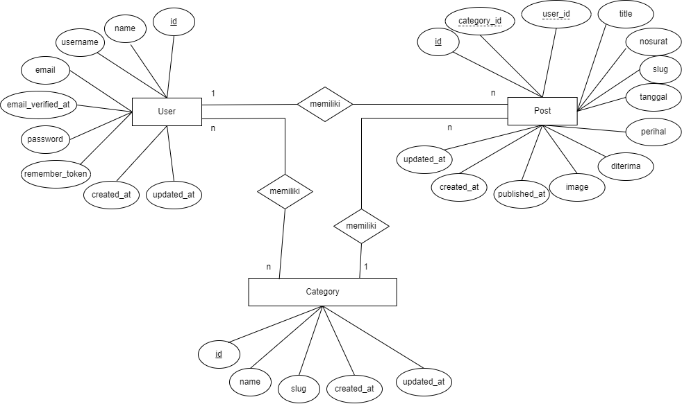

# 📁 Website E-Arsip - Dinas Kominfo Kota Madiun

## 📌 Ringkasan Proyek

**Website E-Arsip** adalah sistem manajemen surat masuk dan surat undangan berbasis web yang dikembangkan untuk **Dinas Komunikasi dan Informatika Kota Madiun**. Sistem ini menggantikan pencatatan manual menggunakan Microsoft Excel dan penyimpanan fisik di *filling cabinet* yang rentan rusak atau hilang.

> 🎯 **Tujuan:** Digitalisasi arsip, peningkatan keamanan dokumen, kemudahan akses dan pencarian data surat.

---

## 🚀 Fitur Utama

| Fitur | Keterangan |
|-------|-------------|
| ✅ Autentikasi | Login & registrasi (tersembunyi) |
| ✅ CRUD Data Surat | Create, Read, Update, Delete |
| ✅ Upload File PDF | Scan surat disimpan sebagai backup |
| ✅ Kategori Surat | Surat Masuk / Surat Undangan |
| ✅ Pencarian | Cari surat berdasarkan kata kunci |
| ✅ Dashboard | Menampilkan jumlah surat per kategori |

---

## 🛠️ Teknologi yang Digunakan

| Kategori | Teknologi |
|----------|-----------|
| Backend | Laravel (PHP Framework) |
| Database | MySQL |
| Frontend | Bootstrap 5, HTML, CSS, JavaScript |
| Local Server | XAMPP |
| Editor | Visual Studio Code |

---

## 📸 Screenshot Tampilan

### 1. Halaman Login

### 2. Halaman Dashboard

### 3. Tabel Data Surat

### 4. Form Tambah Data

### 5. Form Edit Data

### 6. Halaman Lihat Detail

---

## 🧪 Hasil Pengujian

| No | Fitur | Status |
|----|-------|--------|
| 1 | Login Admin | ✅ Berhasil |
| 2 | Tambah Data Surat | ✅ Berhasil |
| 3 | Edit Data Surat | ✅ Berhasil |
| 4 | Hapus Data Surat | ✅ Berhasil |

---

## 📊 Entity Relationship Diagram (ERD)

**Relasi Antar Tabel:**
- `users` → `posts` (One to Many)
- `categories` → `posts` (One to Many)
- `users` ↔ `categories` (Many to Many)

---

## 👨‍💻 Tentang Pembuat

| Nama | Abiyan Naufal Hilmi |
|------|---------------------|
| Pendidikan | S1 Informatika - UPN "Veteran" Jawa Timur |
| IPK | 3.81/4.00 |
| Tahun | 2024 |

📧 h.abiyan1771@gmail.com  
🔗 [LinkedIn](https://www.linkedin.com/in/abiyan-naufal-hilmi/)

---

## 📄 Lisensi

Proyek ini dikembangkan untuk keperluan **Praktek Kerja Lapangan (PKL)** di Dinas Komunikasi dan Informatika Kota Madiun.
